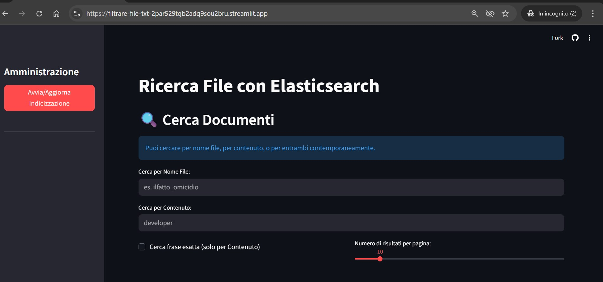
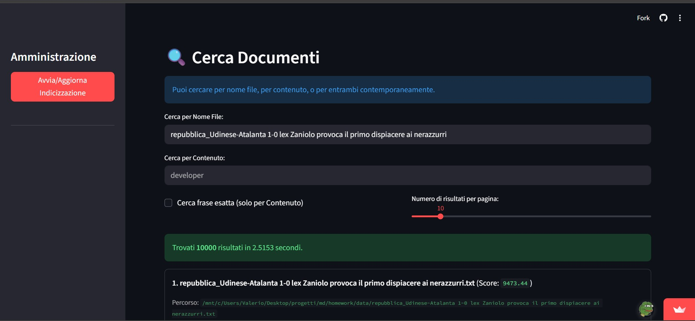
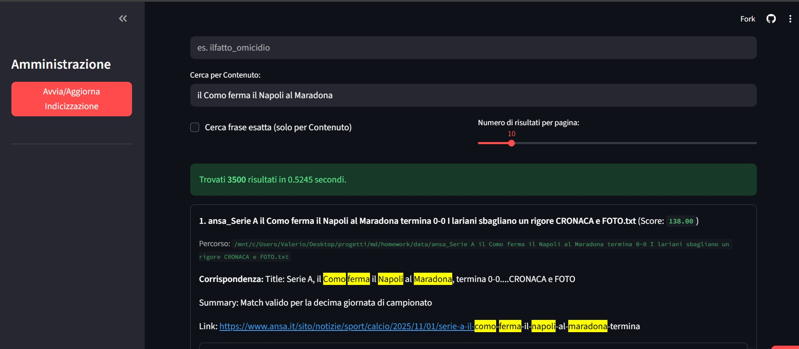
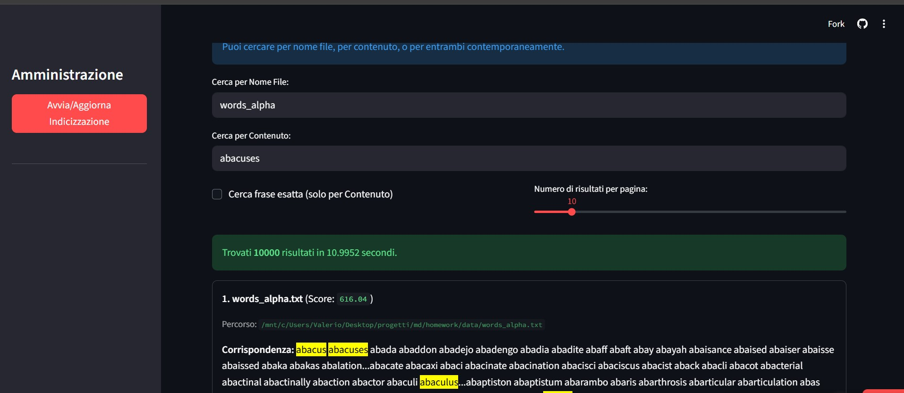

# Ricerca Full-Text di file `.txt` con Elasticsearch e Streamlit
Applicazione web per indicizzare e ricercare file di testo (.txt) presenti in una directory locale.  
Utilizza Elasticsearch per un'indicizzazione e una ricerca full-text efficienti, e Streamlit per un'interfaccia utente semplice e interattiva.

## 💻 Prova l'App Online

Puoi testare direttamente l'applicazione, cliccando sul seguente link:

[Apri l'applicazione](https://filtrare-file-txt-2par529tgb2adq9sou2bru.streamlit.app/)

## Caratteristiche Principali

- **Indicizzazione**: indicizza tutti i file `.txt` in una cartella specificata
- **Ricerca**: cerca per **nome file**, **contenuto** o **entrambi**.
- **Phrase query**: cerca frasi esatte tra virgolette o con checkbox dedicata

## Stack Tecnologico

- **Backend**: Python 3.13+
- **Motore di Ricerca**: Elasticsearch 9.2.0
- **Frontend**: Streamlit
- **Librerie principali**:
  - [`elasticsearch`](https://pypi.org/project/elasticsearch/)
  - [`streamlit`](https://pypi.org/project/streamlit/)
  - [`pydantic`](https://pypi.org/project/pydantic/)

---

## Prerequisiti

- Python 3.12+ installato
- Elasticsearch 9.2.0 in esecuzione (locale o su Docker / Elastic Cloud)

---

## Installazione

### Clonare il repository
0. **salvare repository in locale**

```bash

git clone https://github.com/valeriofiorentini/filtrare-file-txt.git
cd filtrare-file-txt
```
### Setup Ambiente

1. **Creazione ambiente virtuale**

```bash

uv venv
uv sync
```

### 2 Avvio container Elasticsearch

```bash

docker-compose up -d
```

# Visualizzazione Applicazione — Indicizzazione e Ricerca File .txt

## Screenshot

### Home


### Indicizzazione dei file


### Indice dei file


### Ricerca per contenuto


### Ricerca avanzata


### Visualizzazione della possibilità di visionare altri  risultati

